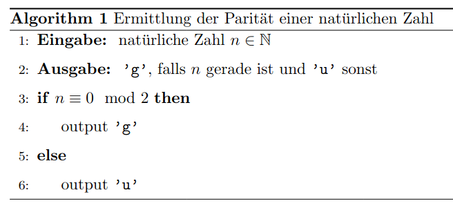

Dieser Beitrag zu Pseudocode orientiert sich an folgendem Buch:
    `Hougardy, Stefan, und Jens Vygen. Algorithmische Mathematik. 2. Aufl. 2018. Berlin, Heidelberg: Springer Berlin Heidelberg, 2018. Web.`

Diese Seite steht aber für sich selbst.
Wir sind inhaltlich sehr flexibel, solange korrekte Berechnungen
durchgeführt werden.
Wir akzeptieren auch die Sprache C selbst oder eine Mischung.
Nur die C-Operatoren sollen wie definiert eingesetzt werden.

# Nutzen von Pseudocode
Wenn ein Algorithmus in einer theoretischen Überlegung beschrieben werden soll, in der die direkte praktische Umsetzung (durch Implementierung in einer Programmiersprache, wie
C) weniger relevant ist, als bspw. Überlegungen zur Funktionsweise oder Laufzeit, so kann sich eine Formulierung mit Pseudocode anbieten. 
Man könnte Pseudocode also als einen Kompromiss zwischen einer umgangssprachlichen Formulierung und einem Ausschnitt eines kompilierbaren Programms bezeichnen.
Nützlich ist hierbei, dass die Beschreibung sich kurz und präzise auf die relevanten Schritte des Algorithmus fokussiert und somit einfacher verständlich für Menschen ist.
Bei Aufgaben, die eine solche Beschreibung eines Algorithmus erfordern, wäre es weiterhin korrekt ein lauffähiges Programm in C anzugeben, jedoch kann man sich in diesem Fall einige
Angaben sparen und eine übersichtlichere Antwort geben. Der Pseudocode lässt sich also typischerweise nicht mehr automatisch in Maschinencode übersetzen, liefert jedoch eine gute Anleitung
zur Implementierung.

# Anforderungen an Pseudocode
Um einen Algorithmus sinnvoll zu beschreiben, sollte Pseudocode folgende Anforderungen erfüllen:
- die Formulierung beschreibt Ein- und Ausgabe des Algorithmus
- alle Berechnungsschritte des Algorithmus werden in der korrekten Reihenfolge beschrieben
- die Beschreibung ist eindeutig
- die Beschreibung ist für Menschen mit dem entsprechenden Hintergrundwissen (z.B. Notation in dieser Vorlesung) verständlich

# Syntax und Semantik
Im Gegensatz zu Programmiersprachen wie C gibt es bei Pseudocode keine einheitlichen Festlegungen zur Syntax. Daher sind hier viele Varianten möglich, solange sie den Anforderungen
an sinnvollen Pseudocode genügen.
Insbesondere sind auch Notationen der mathematischen Fachsprache ggf. hilfreich.
Im folgenden werden beispielhaft einige übliche Symbole und Formulierungen erklärt.
## Wertzuweisung
Die Deklaration und Initialisierung

```
int i;
i = 5;
```

könnte mit einem Pfeil als Darstellung einer Zuweisung und ohne Verwendung des Datentyps und `;` als Pseudocode wie folgt aussehen:

```
i <-- 5
```

## Bedingungen und Schleifen
Hier bietet es sich an ähnliche Schlüsselwörter, wie in C zu verwenden. Dazu gehören z.B. `while`, `for`, `if` und `else`.
Falls klar ist, welche Anweisungen zu welcher Bedingung oder Schleife gehören, können geschweifte Klammern auch weggelassen werden oder mithilfe von Einrückungen
bzw. Formulierungen, wie `if ... then ... endif` dargestellt werden.
Auch deutsche Begriffe wie zum Beispiel `WENN ... DANN` sind vollkommen in
Ordnung.

## Ausgaben
Spezifische Aufrufe von Funktionen zur Ausgabe, wie z.B.
```
int erg = 40 + 2;
printf("Das Ergebnis ist: , %d\n", erg);
```
oder
```
int erg = 40 + 2;
Serial.print(erg);
```

können verkürzt werden zu einer Anweisung, wie
```
erg <-- 40 + 2
output erg
```

# Beispiel
Angenommen wir wollen einen Algorithmus beschreiben, der die Parität einer gegebenen natürlichen Zahl bestimmt, dh. ob sie gerade oder ungerade ist. (Dies ist natürlich nur eine sehr simple Aufgabe, die lediglich die Formulierung von Pseudocode darstellen soll).
Mit Pseudocode könnten wir folgendes formulieren:



Den beschriebenen Algorithmus könnte man nun in C implementieren:

```
#include <stdio.h>
#include <stdlib.h>

int main(void){
    int i;
    scanf("%d", &i);
    if(i % 2 == 0){
        printf("g\n");
    }else{
        printf("u\n");
    }

    return EXIT_SUCCESS;
}
```
Man beachte hierbei auch die Grenzen der Implementierung. Die Formulierung im Pseudocode beschreibt das Vorgehen für eine beliebige natürliche Zahl, die mit einem C-int aber nicht immer dargestellt werden kann.

# Darstellung von Pseudocode mit LaTeX
Für diejenigen, die ihre Aufschriebe mithilfe des Textsatzsystems LaTeX erstellen, kann es sich lohnen packages, wie `algorithm` oder `algpseudocode` nachzuschlagen. Diese erleichtern die Darstellung von Algorithmen im besprochenen Format erheblich.
